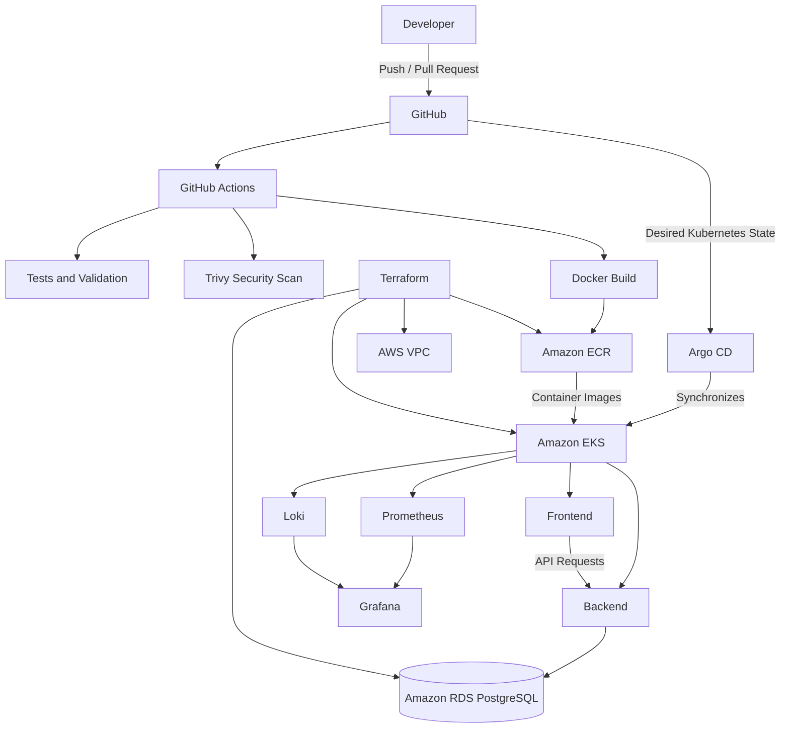

# CloudOps Platform

CloudOps Platform is a production-oriented DevOps project built around a containerized web application running on AWS. The project demonstrates how application delivery, cloud infrastructure, Kubernetes orchestration, monitoring, security, and deployment automation can work together as a single platform.

The application consists of a React frontend, a FastAPI backend, and PostgreSQL. Application workloads run on Amazon EKS, while the production database is hosted on Amazon RDS. AWS infrastructure is provisioned with Terraform.

## Architecture



The delivery process starts when a change is pushed to GitHub. GitHub Actions validates the application, builds the Docker images, performs vulnerability scanning with Trivy, and publishes approved images to Amazon ECR.

Application deployment follows a GitOps workflow. Argo CD continuously compares the configuration stored in Git with the state of the EKS cluster and synchronizes changes when required. This keeps Git as the source of truth for application deployment and makes configuration drift visible.

Terraform manages the AWS infrastructure, including networking, IAM, EKS, ECR, and RDS. Application workloads are deployed to Kubernetes using Helm, while environment-specific configuration is kept separate from the application source code.

## Kubernetes

The application runs as multiple Kubernetes workloads rather than as manually managed application processes. Deployments define the desired application state, Services provide stable communication between workloads, and Ingress controls external access to the platform.

Application containers define resource requests and limits together with liveness and readiness probes. Kubernetes can therefore distinguish between a failed container and an application instance that is running but temporarily unable to receive traffic.

Horizontal Pod Autoscaler adjusts the number of application replicas as resource utilization changes. Rolling deployments allow new application versions to be introduced without replacing every running instance at once.

Helm is used to package the Kubernetes configuration and provide reusable values for different environments.

## CI/CD and GitOps

Continuous integration is handled by GitHub Actions. Each application change passes through automated validation before a container image can become a deployable artifact.

The pipeline builds Docker images, executes application checks, scans images with Trivy, authenticates with AWS, and publishes successful builds to Amazon ECR. A failed test or unacceptable security finding prevents the affected build from progressing.

Continuous delivery is handled separately through Argo CD. Instead of allowing the CI pipeline to make uncontrolled changes directly to the cluster, the desired deployment state is stored in Git and reconciled by Argo CD.

This separation provides a clear path from source code to container artifact and from declarative configuration to the running Kubernetes workload.

## Infrastructure as Code

AWS infrastructure is managed through Terraform.

The platform uses a dedicated VPC with separated networking for externally accessible and internal resources. Amazon EKS provides the Kubernetes environment, Amazon ECR stores application images, and Amazon RDS provides managed PostgreSQL persistence.

IAM roles and policies are defined with least-privilege access in mind, while security groups control communication between infrastructure components.

Because the infrastructure is represented as code, changes can be reviewed through Terraform plans before being applied and the environment can be reproduced without manually rebuilding resources through the AWS Console.

## Observability

Prometheus collects Kubernetes and application metrics, while Grafana provides dashboards for monitoring the state of the platform. Loki centralizes application and Kubernetes logs and makes them available alongside metrics through Grafana.

The monitoring setup provides visibility into resource consumption, pod availability, application health, request behavior, and failures.

This allows operational problems to be investigated from both metrics and logs instead of relying only on the current state of Kubernetes resources.

## Reliability

The platform is designed to demonstrate several failure and recovery scenarios.

If an application pod fails, Kubernetes restores the desired number of replicas automatically. If demand increases, Horizontal Pod Autoscaler can create additional replicas. During application updates, rolling deployments gradually replace the previous version while healthy instances continue serving traffic.

Application health is exposed through dedicated endpoints:

| Endpoint | Purpose |
| --- | --- |
| `/health` | Application health |
| `/api/status` | Runtime and environment information |
| `/api/database` | PostgreSQL connectivity |

These checks are also used to distinguish application process availability from actual readiness to receive traffic.

Argo CD provides an additional reliability mechanism at the configuration level. Manual changes that cause the cluster to differ from the desired Git state are detected as configuration drift and can be reconciled back to the declared configuration.

## Security

Security checks are integrated into both the delivery process and the runtime environment.

Container images are scanned with Trivy before deployment. Credentials and environment-specific secrets are kept outside source control, Kubernetes access is restricted through RBAC, and network policies limit unnecessary communication between workloads.

AWS access is controlled through IAM roles and policies rather than embedding cloud credentials in application code.

The objective is to treat security as part of the deployment lifecycle rather than as a separate step performed after the application has already been deployed.

## Technology Stack

| Area | Technology |
| --- | --- |
| Cloud | AWS |
| Infrastructure | Terraform |
| Containers | Docker |
| Orchestration | Kubernetes / Amazon EKS |
| Kubernetes Packaging | Helm |
| CI | GitHub Actions |
| GitOps / CD | Argo CD |
| Container Registry | Amazon ECR |
| Monitoring | Prometheus, Grafana |
| Logging | Loki |
| Security Scanning | Trivy |
| Backend | Python / FastAPI |
| Frontend | React |
| Database | PostgreSQL / Amazon RDS |
| Automation | Bash |

## Local Development

The backend can be started locally using a Python virtual environment.

```bash
cd backend
python -m venv venv
pip install -r requirements.txt
```

Create `.env` from the provided `.env.example` and configure the local PostgreSQL connection.

On Windows:

```powershell
.\venv\Scripts\Activate.ps1
python -m uvicorn app.main:app --reload
```

The API is then available at `http://127.0.0.1:8000`, with interactive API documentation at `http://127.0.0.1:8000/docs`.

## Purpose

CloudOps Platform focuses on the operational lifecycle of an application rather than application complexity itself. The application provides the workload, while the primary engineering focus is the infrastructure and automation required to build, deploy, operate, secure, monitor, scale, and recover that workload in a cloud-native environment.
